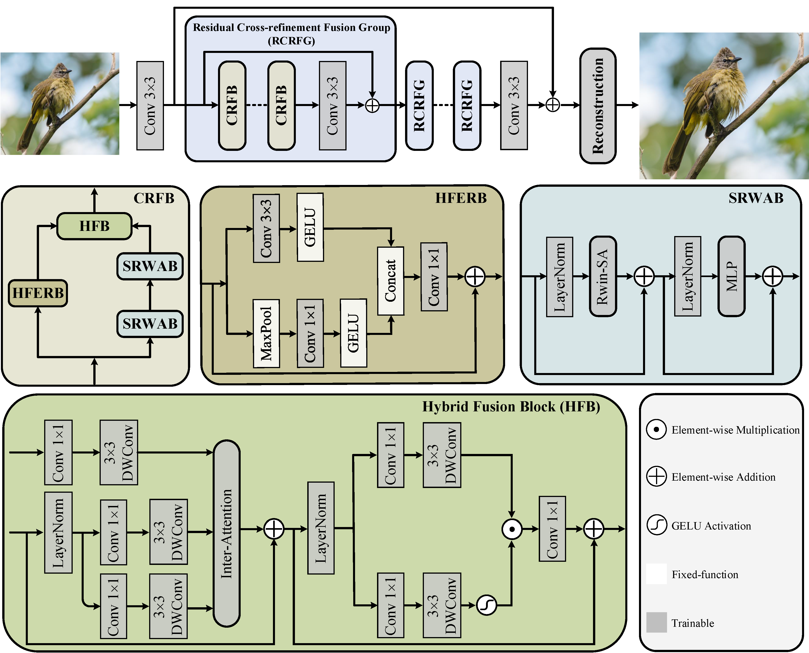
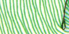

# Feature Modulation Transformer: Cross-Refinement of Global Representation via High-Frequency Prior for Image Super-Resolution

Ao Li, Le Zhang, Yun Liu and Ce Zhu, "Feature Modulation Transformer: Cross-Refinement of Global Representation via High-Frequency Prior for Image Super-Resolution", ICCV, 2023

[[paper](https://openaccess.thecvf.com/content/ICCV2023/papers/Li_Feature_Modulation_Transformer_Cross-Refinement_of_Global_Representation_via_High-Frequency_Prior_ICCV_2023_paper.pdf)] [[pretrained models](https://drive.google.com/file/d/13wAmc93BPeBUBQ24zUZOuUpdBFG2aAY5/view?usp=sharing)]

---

> **Abstract:** *Transformer-based methods have exhibited remarkable potential in single image super-resolution (SISR) by effectively extracting long-range dependencies. However, most of the current research in this area has prioritized the design of transformer blocks to capture global information, while overlooking the importance of incorporating high-frequency priors, which we believe could be beneficial. In our study, we conducted a series of experiments and found that transformer structures are more adept at capturing low-frequency information, but have limited capacity in constructing high-frequency representations when compared to their convolutional counterparts. Our proposed solution, the cross-refinement adaptive feature modulation transformer (CRAFT), integrates the strengths of both convolutional and transformer structures. It comprises three key components: the high-frequency enhancement residual block (HFERB) for extracting high-frequency information, the shift rectangle window attention block (SRWAB) for capturing global information, and the hybrid fusion block (HFB) for refining the global representation. Our experiments on multiple datasets demonstrate that CRAFT outperforms state-of-the-art methods by up to 0.29dB while using fewer parameters.*
>
> <p align="center">
> 
> </p>

---

|                      HR                      |                        LR                         | [SwinIR](https://github.com/JingyunLiang/SwinIR) |  [ESRT](https://github.com/luissen/ESRT)  |                  CRAFT (ours)                   |
| :------------------------------------------: | :-----------------------------------------------: | :----------------------------------------------: | :-------------------------------------------: | :-------------------------------------------: |
|  |  |  |  |  |
|  |  |  |  |  |

## Dependencies & Installation

- Python 3.7
- PyTorch 1.10.2
- NVIDIA GPU + [CUDA 11.7](https://developer.nvidia.com/cuda-downloads)

```bash
# Clone the github repo and go to the default directory 'CRAFT'.
git clone https://github.com/AVC2-UESTC/CRAFT-SR.git
conda create -n CRAFT python=3.7
conda activate CRAFT
pip install -r requirements.txt
python setup.py develop
```

## Training

### Train with DIV2K

- Download [train datasets](https://cv.snu.ac.kr/research/EDSR/DIV2K.tar), place them in `datasets/`.

- Run the following scripts.

  ```shell
  # train with 4 GPUs
  # X2 
  bash scripts/dist_train.sh 4 options/train/CRAFT/train_CRAFT_SRx2_scratch.yml 
  # X3
  bash scripts/dist_train.sh 4 options/train/CRAFT/train_CRAFT_SRx3_scratch.yml 
  # X4
  bash scripts/dist_train.sh 4 options/train/CRAFT/train_CRAFT_SRx4_scratch.yml 
  ```

## Testing

### Test images with HR

- Download the pre-trained [models](https://drive.google.com/file/d/13wAmc93BPeBUBQ24zUZOuUpdBFG2aAY5/view?usp=sharing) and place them in `experiments/pretrained_models/`.

  We provide pre-trained models for image SR: CRAFT_MODEL_X2, CRAFT_MODEL_X3, and CRAFT_MODEL_X4.

- Download [test datasets](https://drive.google.com/drive/folders/1BtRY2CfpXfgkzabwDmrJaKl1LcIfdsQu?usp=sharing), place them in `datasets/benchmark`.

- Run the following scripts.

  ```shell
  # test Set5 
  # X2 
  python inference/inference_CRAFT.py --scale 2 --model_path experiments/pretrained_models/CRAFT_MODEL_X2.pth --folder_lq datasets/benchmark/Set5/LR_bicubic/X2 --input datasets/benchmark/Set5/HR --output results/CRAFT/Set5/X2
  # X3
  python inference/inference_CRAFT.py --scale 3 --model_path experiments/pretrained_models/CRAFT_MODEL_X3.pth --folder_lq datasets/benchmark/Set5/LR_bicubic/X3 --input datasets/benchmark/Set5/HR --output results/CRAFT/Set5/X3
  # X4
  python inference/inference_CRAFT.py --scale 4 --model_path experiments/pretrained_models/CRAFT_MODEL_X4.pth --folder_lq datasets/benchmark/Set5/LR_bicubic/X4 --input datasets/benchmark/Set5/HR --output results/CRAFT/Set5/X4
  ```
- The output is in `results/`.


## Results

| Model         | #Parameters | Set5         | Set14        | BSD100        | Urban100      | Manga109     |
|:-------------:|:-----------:|:------------:|:------------:|:-------------:|:-------------:|:------------:|
|CRAFT-X2       | 737K        | 38.23/0.9615 |33.92/0.9211  |32.33/0.9016   |32.86/0.9343   |39.39/0.9786  |
|CRAFT-X3       | 744K        | 34.71/0.9295 |30.61/0.8469  |29.24/0.8093   |28.77/0.8635   |34.29/0.9491  |
|CRAFT-X4       | 753K        | 32.52/0.8989 |28.85/0.7872  |27.72/0.7418   |26.56/0.7995   |31.18/0.9168  |

## Citation

If you find the code helpful in your research or work, please cite the following paper(s).

```
@inproceedings{li2023craft,
  title={Feature Modulation Transformer: Cross-Refinement of Global Representation via High-Frequency Prior for Image Super-Resolution},
  author={Li, Ao and Zhang, Le and Liu, Yun and Zhu, Ce},
  booktitle={Proceedings of the IEEE/CVF International Conference on Computer Vision},
  pages={12514--12524},
  year={2023}
}
```

## Acknowledgements

This code is built on  [BasicSR](https://github.com/XPixelGroup/BasicSR), [CAT](https://github.com/zhengchen1999/CAT), and [Restormer](https://github.com/swz30/Restormer).